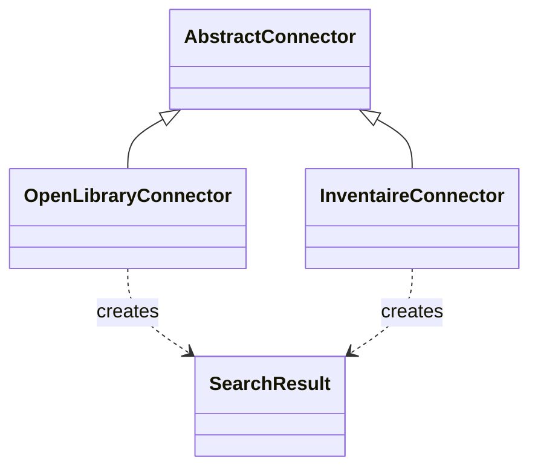

# Adapter Pattern

Connectors translate external book data into a common SearchResult format.

```mermaid
classDiagram
    class AbstractConnector
    class OpenLibraryConnector
    class InventaireConnector
    class SearchResult
    AbstractConnector <|-- OpenLibraryConnector
    AbstractConnector <|-- InventaireConnector
    OpenLibraryConnector ..> SearchResult : creates
    InventaireConnector ..> SearchResult : creates
```
