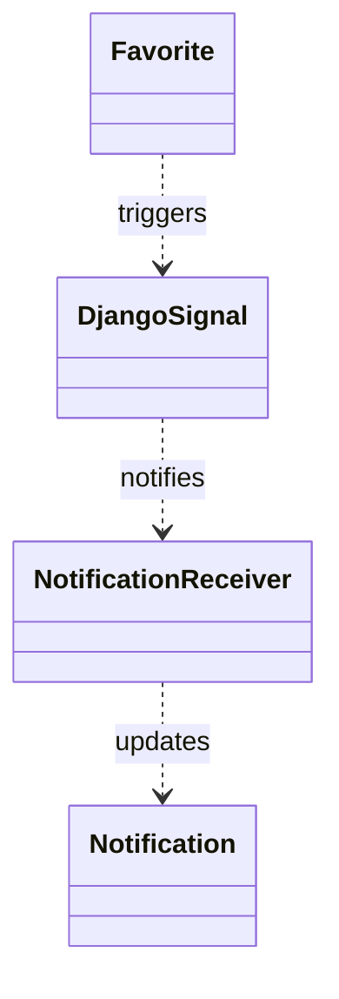

# Observer Pattern

Django signals notify registered functions when model events occur.

```mermaid
classDiagram
    class Favorite
    class DjangoSignal
    class NotificationReceiver
    class Notification
    Favorite ..> DjangoSignal : triggers
    DjangoSignal ..> NotificationReceiver : notifies
    NotificationReceiver ..> Notification : updates
```
