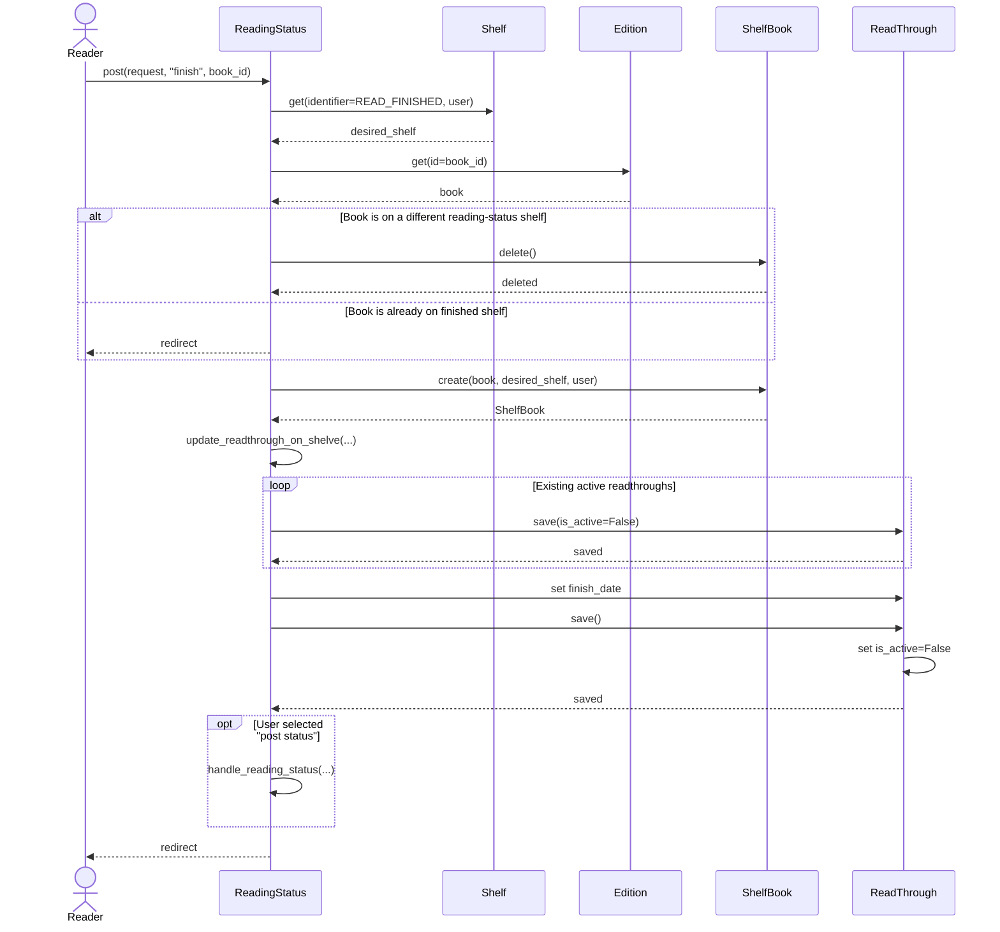

# Interaction Diagram: Finish Reading a Book

This interaction diagram expands the `finish` system event from the Finish Reading SSD and shows the objects inside BookWyrm that collaborate to complete the operation.

