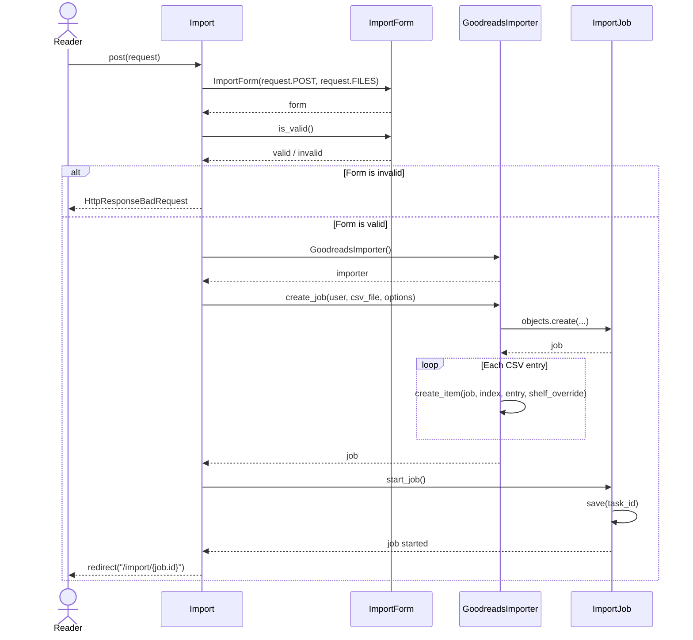

# Interaction Diagram: Import Reading History

This interaction diagram shows how BookWyrm handles a reading history CSV import. The `Import` view validates the request, selects the correct importer, creates an import job, and starts the background import process.

